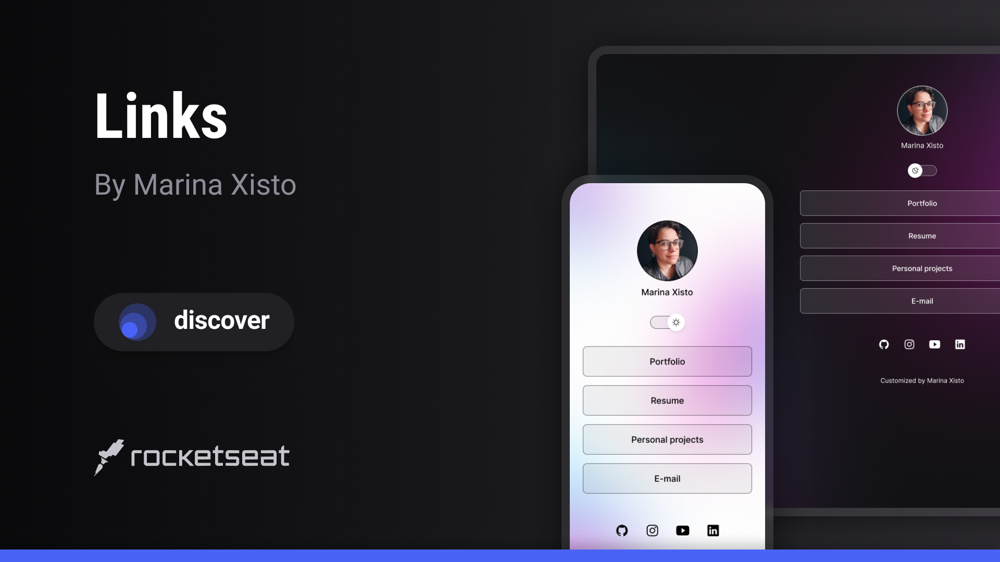

<h1 align="center"> Links </h1>

A Discover course project. Discover is an exclusive and free program promoted by Rocketseat for teaching WEB technologies. 
Find out more about the program by <a href="https://lp.rocketseat.com.br/devlinks/inscricao?utm_source=github&utm_medium=descricao&utm_campaign=capture-devlinks&utm_term=organic&utm_content=descricao-github-mayk-brito">clicking here.</a>

  

 

  

## 🚀 Technologies

- HTML e CSS
- JavaScript
- Git e Github
- Figma

## 💻 Project

DevLinks is a link aggregator to use as an online business card.

- [Access the finished project online](https://marinaxisto.github.io/links)

## 🔖 Layout

You can view the project layout through [THIS FIGMA LINK](https://www.figma.com/community/file/1187422022288947321).

## :memo: License

This project is under the MIT license.

---

Rebuilt and customized by [Marina Xisto Almeida](https://github.com/marinaxisto)
